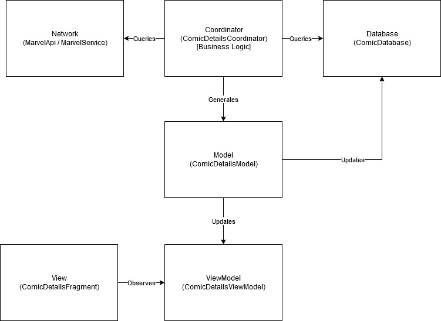

## README

## About
This repository contains a simple, single screen native Android comic details page viewer application powered by the Marvel Developer API (https://developer.marvel.com/). 

Users will be presented with a page detailing a comic upon opening. There is a refresh button to query a random comic. Unfortuantely I couldn't find an API for getting a random list of comicIds from the Marvel API, so the application will query a random Id between 1 and 20,000. If the Id is found, the results will be cached in a local DB and displayed on the screen. If the results are not found, it is added to a database of invalid ids and the user can try again. Kind of like comic roullette.
It was written using 100% kotlin and follows a semi MVVM architecture.

### Libraries / Dependencies used
* Retrofit - Network calls (https://square.github.io/retrofit/)
* RxJava - Reactive functionality (http://reactivex.io/) or (https://github.com/ReactiveX/RxJava)
* Chuck - HTTP inspection (debugging) (https://github.com/jgilfelt/chuck)
* Dagger - Dependency injection (https://github.com/google/dagger)
* Glide - Image loading (https://github.com/bumptech/glide)
* Room - Interfacing with sqlite database (https://developer.android.com/training/data-storage/room/index.html)
* Stetho - More debugging (https://github.com/facebook/stetho)
* ktlint - Linting / code quality (https://ktlint.github.io/)

### Steps to run
1) Create a Marvel Developer account at https://developer.marvel.com/
2) Pull down the project
3) Create a keystore.properties file in the root directory
4) Define MARVEL_API_PRIVATE_KEY and MARVEL_API_PUBLIC_KEY in the keystore.properties. These keys can be obtained from your Marvel developer account.  
4a) MARVEL_API_PUBLIC_KEY = "<YOUR_PUBLIC_KEY_HERE>"  
4b) MARVEL_API_PRIVATE_KEY = "<YOUR_PRIVATE_KEY_HERE>"  
5) Build, run, and be super!

### GIF

